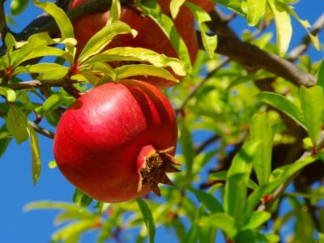

# This file holds information about the 11 different plant types that are classified in this project.

## Jatophra
- Plant type: (Jatophra Curcas) Flowering Plant 
- Common Name: Coral Plant
- Native to: Mexico/Central America
- Image of plant: 
- Care Tips: 
* Well Drained Soil
* Can handle partial sunlight, prefer full sunlight
* Avoid frost zones

## Pongamia Pinnata 
- Plant type: Tree 
- Common Name: Pongamia 
- Native to: Eastern & Tropical Asia, Australia, Pacific Islands
- Image of plant: 
- Care Tips: 
* Shade tolerant, prefers sun
* Well-drained sandy loams with assured moisture

## Pomegranate
- Plant type: Fruit Bearing Deciduous Shrub
- Common Name: Pomegranate 
- Native to: Mediterranean Region 
- Image of plant: 
- Care Tips: 
* 50-60 in water/year
* Maintain soil moisture in summer and early fall to prevent fruit splitting
* 4-6 hours of bright sunlight/day (may need to supplement with grow lights)

## Mango
- Plant type: Fruit Bearing Flowering Tree
- Common Name: Mango
- Native to: Myanmar, Bangladesh & Northern India
- Image of plant: 
- Care Tips: 
* Above 50% Humidity
* Always above 50 Deg F
* Every day for first 6 weeks, every 2-3 days after

## Pongamia Pinnata
- Plant type: Tree 
- Common Name: Karanji (Hindi) 
- Native to: Eastern & Tropical Asia, Australia, & Pacific Islands
- Image of plant: 
- Care Tips: 
* Full sun
* Well drained soil

## Alstonia Scholaris
- Plant type: Evergreen Tropical Tree
- Common Name: Blackboard Tree; Devil's Tree 
- Native to: Southern China, Tropical Asia, Australasia 
- Image of plant: 
- Care Tips: 
* Water regularly, do not overwater
* Sun to partial shade

## Chinar
- Plant type: Deciduous Tree
- Common Name: Old world sycamore; Oriental Plane
- Native to: Kashmiri Valley
- Image of plant: 
- Care Tips: 
* Full to partial sun
* Water once a day
* Drought tolerant
* Rich, moist, well-drained, fertile soil  (alkaline or acidic)

## Lemon
- Plant type: Evergreen Tree 
- Common Name: Lemon 
- Native to: South Asia
- Image of plant: 
- Care Tips: 
* Needs good drainage
* Consistent and regular watering
* Full sun (8-10 hours) with southern exposure

## Guava
- Plant type: Evergreen Shrub
- Common Name: Guava
- Native to: Carribean, Central America, South America
- Image of plant: 
- Care Tips: 
* Water frequently 
* Good drainage
* Full sun

## Basil
- Plant type: Culinary Herb 
- Common Name: Basil 
- Native to: Tropical regions from Central Africa to Southeast Asia
- Image of plant: 
- Care Tips: 
* Water frequently (1 in/week)
* Fertilize lightly 
* Pinch back leaves
* Lots of sunlight!

## Jamun
- Plant type: Evergreen Tropical Tree 
- Common Name: Black Plum
- Native to: South & Southeast Asia
- Image of plant: 
- Care Tips: 
* Enough water to keep soil moist
* Keep in partial shade

## Arjun
- Plant type: Terminalia Tree
- Common Name: Arjuna 
- Native to: India & Sri Lanka
- Image of plant: 
- Care Tips: 
* Full Sun
* Well Drained, moderately fertile soil 

